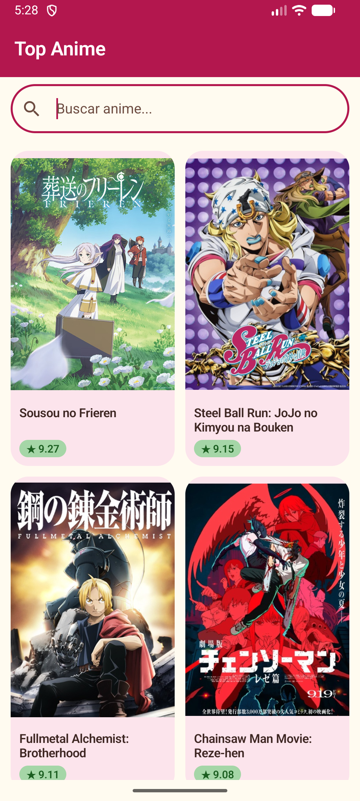
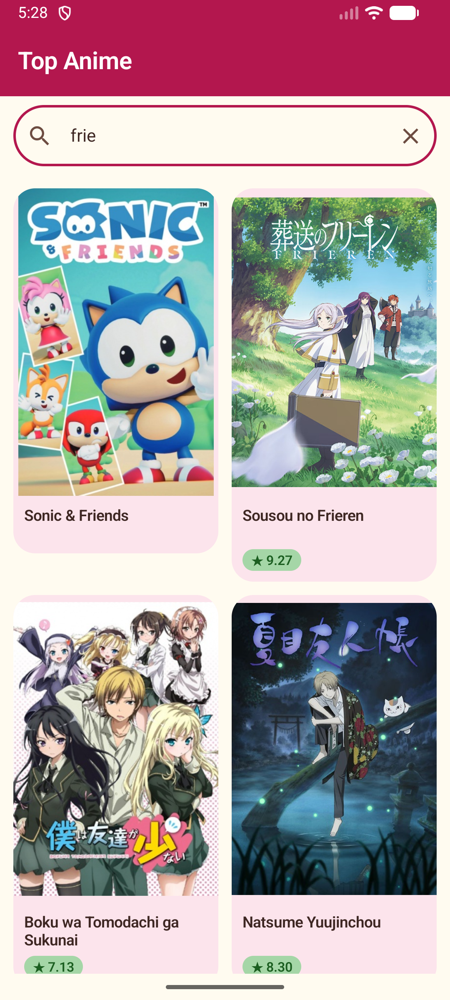
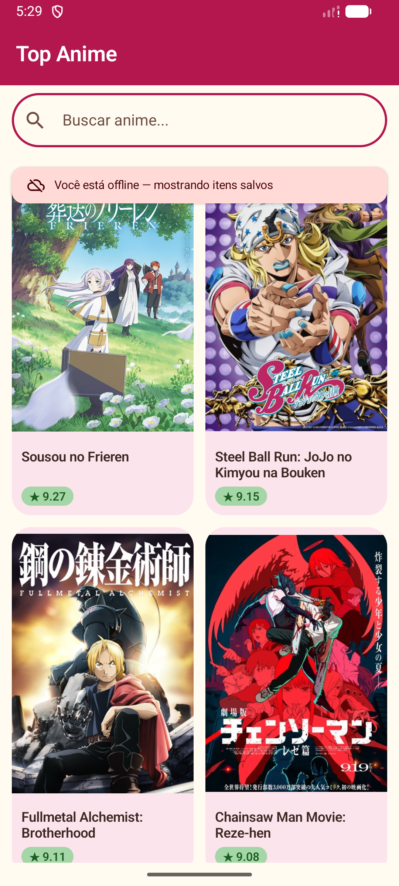

# AnimeWiki 🌸

> A modern Android sample app exploring the [Jikan API](https://jikan.moe/) (an unofficial MyAnimeList wrapper) with offline-first caching, reactive search, and a custom Material 3 design system.


---

## 🎬 Demo

<!--
  To embed the video: on GitHub, drag the .mp4 file into the description of any
  issue/PR — GitHub uploads it to their CDN and returns a URL like
  https://github.com/user-attachments/assets/xxxxxxxx.mp4
  Paste that URL here as plain text (no Markdown) and GitHub renders an inline player.
-->

https://github.com/user-attachments/assets/25c90d25-fa4a-48b1-a2e5-d2a1e1d17fef

---

## 📱 Screenshots

<!-- Substitute these with real screenshots captured on the emulator. -->
<table>
  <tr>
    <td></td>
    <td></td>
    <td></td>
    <td></td>
  </tr>
  <tr>
    <td align="center"><sub>Top anime grid</sub></td>
    <td align="center"><sub>Details screen</sub></td>
    <td align="center"><sub>Search with debounce</sub></td>
    <td align="center"><sub>Offline-first</sub></td>
  </tr>
</table>

---

## ✨ Features

- **Top anime grid** with infinite scroll via Paging 3
- **Rich details screen** with synopsis, genres, studios, airing info, and score
- **Reactive search** that debounces user input and swaps data sources on the fly
- **Pull-to-refresh** on the main grid
- **Offline-first** cached content is shown instantly on cold start, with a discreet error banner when the network is unreachable
- **Custom "Sakura Dream" Material 3 theme** with light/dark color schemes and the Quicksand typeface
- **Favorites** with a dedicated tab, persisting through a reactive Room query
- **Bilingual** (Portuguese and English) with automatic locale detection

---

## 🛠️ Tech Stack

| Category | Library |
|---|---|
| UI | Jetpack Compose + Material 3 |
| Navigation | Navigation Compose |
| DI | Hilt (via KSP, no KAPT) |
| Networking | Retrofit 2 + OkHttp + Kotlinx Serialization |
| Image loading | Coil 3 |
| Paging | Paging 3 with `RemoteMediator` |
| Local storage | Room 2.7 |
| Async | Kotlin Coroutines + Flow |
| Build | Gradle Kotlin DSL + Version Catalog |

---

## 🏗️ Architecture

Layered, single-module, MVVM with a unidirectional data flow.

```
┌─────────────────────────────────────────────────────────┐
│  UI (Compose)                                           │
│  Screens · Components · AnimeWikiScaffold · Theme       │
└───────────────────────────┬─────────────────────────────┘
                            │ StateFlow<UiState> · PagingData
┌───────────────────────────┴─────────────────────────────┐
│  ViewModel                                              │
│  Orchestrates query state, switches data sources        │
└───────────────────────────┬─────────────────────────────┘
                            │ Flow<PagingData<Anime>>
┌───────────────────────────┴─────────────────────────────┐
│  Data                                                   │
│  ┌─────────────┐      ┌──────────────────────────────┐  │
│  │ Repository  │◄────▶│ RemoteMediator + PagingSource│  │
│  └──────┬──────┘      └──────┬──────────────────┬────┘  │
│         │                    │                  │       │
│    ┌────▼────┐          ┌────▼─────┐       ┌────▼────┐  │
│    │  Room   │          │ Retrofit │       │  Coil   │  │
│    └─────────┘          └──────────┘       └─────────┘  │
└─────────────────────────────────────────────────────────┘
```

- **The UI never talks to the network directly.** It observes `Flow<PagingData>` from the ViewModel.
- **Room is the single source of truth for the top anime list.** The `RemoteMediator` is responsible for filling and refreshing it from the Jikan API.
- **Search results are transient** (no caching) a lightweight `PagingSource` fetches directly from the API.

---

## 💡 Implementation Highlights

### Offline-first pagination with `RemoteMediator`

The top grid doesn't just cache a few items it **persists paginated state** (`prev`/`next` page keys per anime) so scrolling, closing the app, and reopening offline all behave naturally.

```kotlin
override suspend fun load(
    loadType: LoadType,
    state: PagingState<Int, AnimeEntity>
): MediatorResult {
    val page = when (loadType) {
        LoadType.REFRESH -> 1
        LoadType.APPEND -> state.lastItemOrNull()
            ?.let { db.remoteKeyDao().getKey(it.id)?.nextKey }
            ?: return MediatorResult.Success(endOfPaginationReached = true)
        LoadType.PREPEND -> return MediatorResult.Success(endOfPaginationReached = true)
    }

    return try {
        val response = api.getTopAnime(page = page, limit = state.config.pageSize)
        db.withTransaction {
            if (loadType == LoadType.REFRESH) {
                db.remoteKeyDao().clearAll()
                db.animeDao().clearAll()
            }
            db.remoteKeyDao().upsertAll(/* ... */)
            db.animeDao().upsertAll(/* ... */)
        }
        MediatorResult.Success(endOfPaginationReached = !response.pagination.hasNextPage)
    } catch (e: CancellationException) {
        throw e
    } catch (e: Exception) {
        MediatorResult.Error(e)
    }
}
```

### Reactive search with five Flow operators working together

The search field emits to a `StateFlow<String>`. A small pipeline debounces keystrokes, swaps data sources on an empty query, and cancels in-flight requests when the query changes:

```kotlin
@OptIn(FlowPreview::class, ExperimentalCoroutinesApi::class)
val animeList: Flow<PagingData<Anime>> = _query
    .debounce { q -> if (q.isBlank()) 0L else 400L }
    .distinctUntilChanged()
    .flatMapLatest { q ->
        if (q.isBlank()) repository.topAnime()
        else repository.searchAnime(q.trim())
    }
    .cachedIn(viewModelScope)
```

`flatMapLatest` guarantees that typing "fr" → "fri" → "frie" only keeps the last subscription alive; `cachedIn` survives configuration changes.

### Custom Material 3 color scheme

The "Sakura Dream" palette is tuned so user-chosen brand colors become `primaryContainer` / `secondaryContainer` / `tertiaryContainer`, while derived darker tones drive `primary` / `secondary` / `tertiary` and meet WCAG AA contrast against `onPrimary` text.

```kotlin
private val SakuraLightColors = lightColorScheme(
    primary = SakuraRose,           // deep rose WCAG AA against white
    primaryContainer = SakuraPink,  // the original #F48FB1 soft, gentle
    secondary = LavenderPlum,
    secondaryContainer = LavenderMist,
    tertiary = MatchaDeepGreen,
    tertiaryContainer = MatchaGreen,
    background = CreamShell,
    /* … */
)
```

---

## 📁 Project Structure

```
app/src/main/java/com/example/animewiki/
├── data/
│   ├── local/           # Room: entities, DAOs, converters, AppDatabase
│   ├── remote/          # Retrofit + Kotlinx Serialization DTOs
│   ├── paging/          # RemoteMediator + transient SearchPagingSource
│   ├── mapper/          # DTO ↔ Entity ↔ Domain conversions
│   └── repository/      # Exposes Flow<PagingData> to the UI
├── domain/
│   └── model/           # Plain Kotlin models, free of any framework
├── di/                  # Hilt modules (Network, Database)
├── ui/
│   ├── theme/           # Sakura Dream: colors, typography, shapes
│   ├── components/      # Shared composables (AnimeWikiScaffold)
│   ├── navigation/      # NavHost + destinations
│   └── screens/
│       ├── topAnime/    # Top anime grid + search + its components
│       └── details/     # Anime details + its components
├── AnimeWikiApp.kt      # @HiltAndroidApp entry point
└── MainActivity.kt      # @AndroidEntryPoint host
```

---

## 🚀 Getting Started

```bash
git clone https://github.com/jesstoselli/animewiki.git
cd animewiki
./gradlew assembleDebug
```

Open in Android Studio Ladybug or newer, wait for the Gradle sync, and run on any emulator or device with **API 24+**.

The Jikan API requires no authentication or API key.

---

## 🗺️ Roadmap

- [x] Compose UI + Material 3 custom theme
- [x] Paging 3 on the top anime grid
- [x] Details screen with navigation
- [x] Offline-first caching (Room + RemoteMediator)
- [x] Reactive search with debounce
- [x] Pull-to-refresh
- [x] Favorites screen (local CRUD)
- [x] Internationalization (pt-BR default, en as secondary)
- [ ] User preferences via DataStore (theme toggle)
- [ ] Weekly top-anime push notification (WorkManager + Notifications)
- [ ] Unit & integration tests

---

## 🙏 Credits

- **Data**: [Jikan API v4](https://jikan.moe/) unofficial MyAnimeList REST wrapper
- **Posters & metadata**: © [MyAnimeList](https://myanimelist.net/) and respective rights holders
- **Typeface**: [Quicksand](https://fonts.google.com/specimen/Quicksand) via Google Fonts

---

## 📄 License

MIT. See [LICENSE](LICENSE) for details.

---

<sub>Built as a learning / portfolio project. Not affiliated with MyAnimeList or Jikan.</sub>
